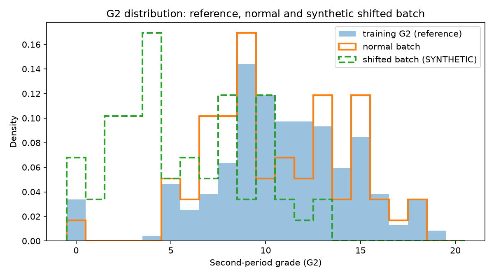

# Input monitoring report

Generated 2026-10-08T15:44:23Z. Active model: v1.

## Reference

- Training G2 mean: 10.8136
- Training G2 population standard deviation: 3.8000 (denominator used: 3.8000)
- Rule: flag `input_shift` when abs(batch mean - training mean) / max(std, 1) > 0.5. This is a demonstration threshold, not a statistically calibrated production alert.

## Batches

| Batch | Rows | Missing inputs | Invalid inputs | G2 mean | Shift score | Result |
|---|---|---|---|---|---|---|
| normal (validation, unmodified) | 59 | 0 | 0 | 10.6102 | 0.0535 | no_shift |
| shifted (validation G2 - 5, clipped at 0) | 59 | 0 | 0 | 5.6949 | 1.3470 | input_shift |

The shifted batch is **synthetic**: validation G2 reduced by 5 and clipped at 0. It was created to demonstrate the trigger, not observed from real students.

## Model error

MAE on the unmodified labelled normal batch (active model v1): 1.3730 grade points (RMSE 2.4359, R2 0.7426).
MAE is not reported for the shifted batch: its inputs were changed, so the original grades are no longer valid labels for it. An input-shift flag is a reason to investigate or collect new labelled data; it is not evidence that accuracy has fallen.

## Distribution chart

## Prediction log summary

- Events: 2
- By status: {'success': 1, 'validation_error': 1}
- By model version: {'v1': 2}

